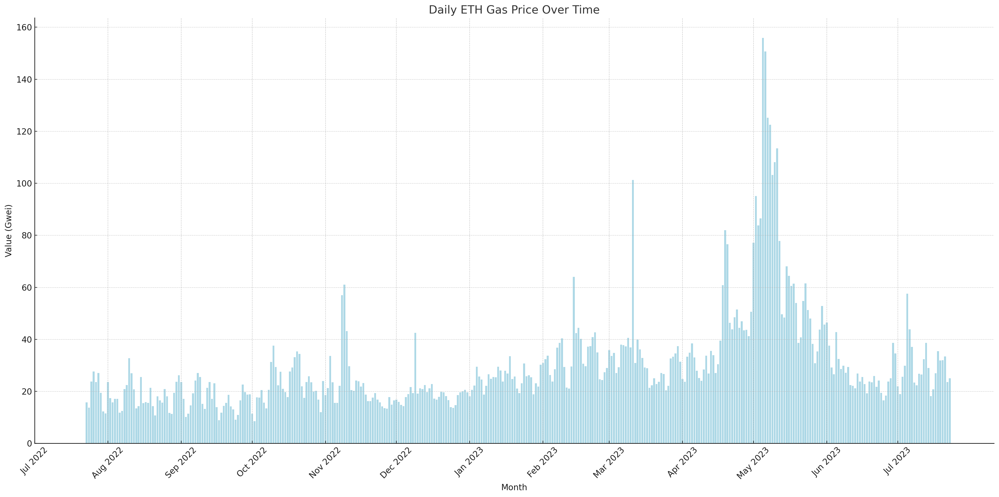
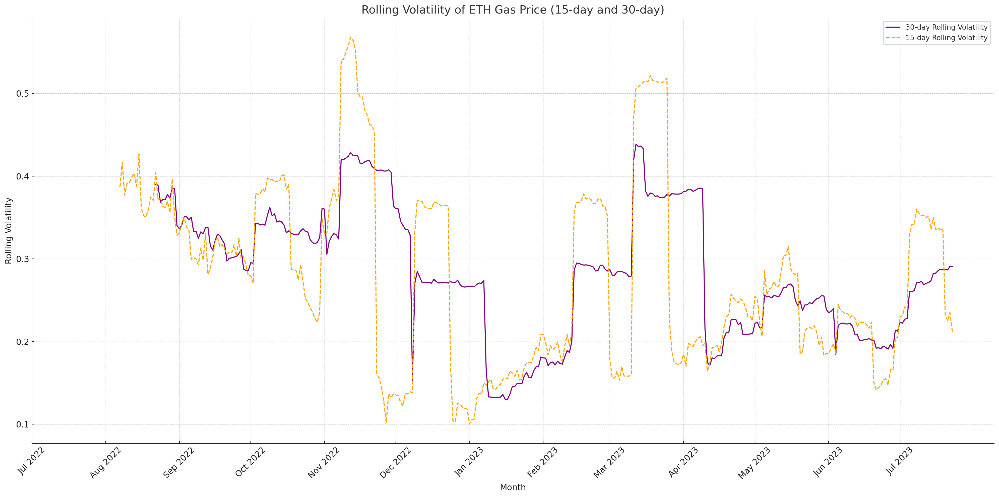
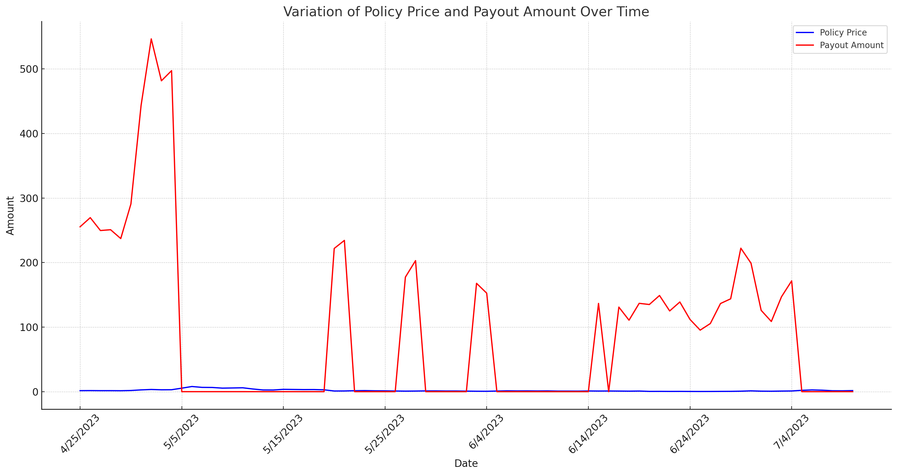
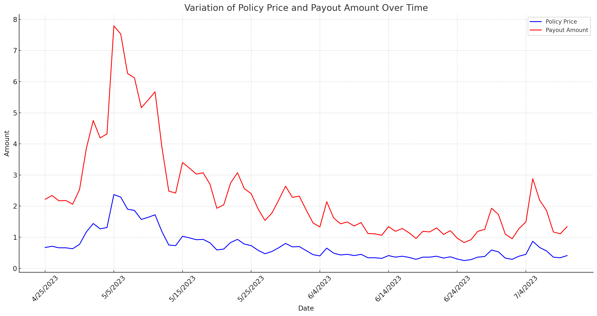

# Hack-a-TONx

Hack-a-TONx 2023

- Demo: TODO
- WebSite : https://gaslockr-website.vercel.app

# GasLockR

Welcome to GasLockR - our MVP submission for the Hack-a-TONx 2023. This project builds upon our legacy product, but with enhancements and additions that provide a robust, user-friendly solution for the blockchain community.

## 🌟 What's New?

### 1. Stripe Integration

We've incorporated **Stripe** to our platform, enabling users to make direct purchases using their credit cards. This integration significantly streamlines the payment process and enhances the versatility of our payment portal.

### 2. Chainlink and Stripe API Fusion

Through **Chainlink**, we've successfully integrated the **Stripe API**, allowing us to fetch real-time payment statuses of our users. This synchronization ensures greater transparency in payments and automation, enhancing user experience and transactional efficiency.

### 3. Chainlink Automation for Insurance Payouts

With the power of **Chainlink Automation**, insurance payouts have been made seamless. Now, claims are processed and validated automatically, ensuring that beneficiaries receive their dues without unnecessary delays or manual interventions.

### 4. Amazon Forecast Integration

By embedding **Amazon Forecast**, we've fortified our insurance financial model. Using advanced machine learning techniques, this integration optimizes our pricing models, ensuring they're both competitive and in alignment with real-world data.

### Fresh UI

Understanding the importance of user experience, we've rolled out an entirely new user interface. Sleeker, more intuitive, and user-friendly, this redesign promises an enhanced user journey, making interactions more enjoyable and straightforward.

### Extended Network Support

In our bid to be more inclusive and accessible, we've added support for multiple networks, both L1 and L2s. This ensures users across various blockchain platforms can benefit from our services without any hitches.

## 💡 Inspiration

Our motivation to build GasLockR emanated from three predominant on-chain challenges:

### 1. Reliability

- **Inconsistent Experience**: The unpredictable nature of gas prices has made it challenging for blockchain platforms to deliver a consistent and usable quality of service.
- **Unforeseen Spikes**: Occasional surges in gas prices can render even Layer 2 solutions temporarily unusable, shaking the trust of users in the blockchain infrastructure.

### 2. Onboarding

- **Initial Token Requirement**: New users face a significant entry barrier as they need to possess tokens upfront to cover gas fees before they can engage in swaps or any other on-chain interactions.

- **Chicken-and-Egg Dilemma**: This initial requirement creates a paradox where users need funds to start an on-chain journey, considerably slowing down the onboarding process.

### 3. UX

- **Gas Fee Management**: Users find themselves constantly having to monitor and select the right gas fees, turning every transaction into a cumbersome task.

- **Complexity for Newcomers**: Such intricacies can be particularly daunting for newcomers, detracting from the essence of Web3 and potentially deterring wider adoption.

## 🚀 Solution

We have developed GasLockR to provide a robust solution to the outlined challenges:

### 1. Gas Pricing Model

Our advanced Gas Pricing Model forms the backbone of GasLockR. Here is how it works:

- **ZK Coprocessor for Historical Gas Price**: This component helps us access historical gas prices, which is crucial in understanding past trends and predicting future gas costs.
- **Transaction Pool Monitor**: It provides real-time block information, allowing us to stay updated with the latest on-chain events and activities.
- **External Oracle for Gas Information**: We employ an external oracle to retrieve gas information, ensuring accurate and timely data for our calculations.
- **Market Events**: Taking into account market events, our model factors in the dynamic nature of the blockchain environment. It can account for significant market events that might cause abrupt changes in gas prices.

Incorporating these elements, we generate a Gas Pricing Model that efficiently determines the pricing for our insurance model.

### 2. Anti-risk GasFi Services

Our Anti-risk GasFi services aim to alleviate the concerns of volatile gas prices:

- **Correctly Priced**: Leveraging the aforementioned Gas Pricing Model, we ensure that our services are correctly priced, reflecting the true cost and risk involved.
- **Automatic Execution**: We employ Chainlink's automation capabilities to monitor on-chain events and automatically execute insurance payouts when necessary.
- **Hedge Volatile Gas Price**: Our services provide an efficient way for users to hedge against the risk of rising gas prices, making blockchain services more reliable and predictable.
- **Payment Flexibility**: Users can pay for our services using both Fiat and ERC20 tokens, providing more flexibility and convenience.

## 🛠️ Build

Our approach recognizes the different needs of blockchain users. Thus, we've introduced two distinct solutions tailored for diverse user requirements:

### 1. GasInsure: Insurance Against Gas Price Volatility

GasInsure offers a way for users to protect themselves against unpredictable and often high gas prices.

#### For the Average User:

- **Simplicity**: Purchase a gas price insurance with straightforward terms.
- **Peace of Mind**: During the insurance's active period, the gas price surges past a predefined limit, the insurance takes effect. Here's the best part: users receive compensation automatically, shielding them from the brunt of unexpected gas fee hikes. Please note: The insurance provides a one-time payout once the threshold is crossed.

#### For the Advanced User:

- **Multi-Layered Strategy**: Advanced users have the flexibility to purchase multiple insurance packages. This not only amplifies potential returns but also offers a strategic advantage in hedging against volatile gas prices.
- **Hands-Free Protection**: There's no need for actual dApp interactions. If the gas price breaches the stipulated boundary, our system kicks in, ensuring that compensation is dispatched without any manual claims or interventions.
- **Strategic Hedging**: This offering is designed for those who have an eye on the bigger picture. By predicting potential gas price spikes and hedging proactively, advanced users can navigate the volatile crypto landscape with increased financial security.

### 2. GasSubscribe: A Subscription for Smooth DApp Interactions

Taking inspiration from conventional mobile data plans, GasSubscribe revolutionizes the way users experience blockchain.

- **User-Centric Subscription**: Choose the duration and enjoy gas-senseless interactions with dApps. No more worrying about fluctuating gas prices with every transaction.
- **DApp Integration**: DApps can offer seamless experiences by subscribing on behalf of their users. This eliminates the friction of gas fees, making onboarding new users simpler than ever.
- **Account Abstraction at Its Best**: With GasSubscribe, we're pushing the boundaries of what's possible. By leveraging account abstraction techniques, we've made it so that users don't even have to think about gas fees. It's all handled in the background, offering a smooth, web2-like experience in the decentralized world.

## 🏆 Insurance Pricing Models

We have gathered daily Ethereum gas prices over the past year and have conducted volatility analyses for both 15-day and 30-day periods.

### 1. Model 1: Normal Backtest Model

#### Overview

This model calculates an insurance policy price based on the maximum price increase observed over a sliding window of gas prices.

#### Key Components:

- **Sliding Window**: Considers a set number of days (e.g., 15) to determine the price trend.
- **Max Rise Calculation**: Determines the maximum relative increase in gas prices over the window.
- **Policy Price Determination**: Based on the maximum rise and an expected payout amount, the insurance policy price is calculated.

#### Formulae:

- **Max Rise**:
  - Max Rise = Max( price[i] / price[i-1] - 1 )
- **Trigger Price for Payout**:
  - Trigger Price = currentPrice \* (1 + Max Rise)
- **Policy Price**:

  - Policy Price = expectedPayout \* 1.15

#### Backtest results

### 2. Model 2: Binary Backtest Model

#### Overview

This model uses a binary option approach to calculate the insurance policy price, incorporating both upward and downward price factors.

#### Key Components:

- **Upward & Downward Price Factors**: `u` and `d` are factors for calculating potential upward and downward price movements.
- **Risk Neutral Probability**: Represents the equal likelihood of price going up or down.
- **Option Pricing Tree**: A tree structure calculates the policy price, considering both early exercise and continuation values.

#### Formulae:

- **Upward Movement**:
  - Price \* u
- **Downward Movement**:
  - Price \* d
- **Trigger Price for Payout**:
  - Trigger Price = currentPrice \* 1.1
- **Option Price**:
  - Uses the binary tree structure to determine the highest value between early exercise or continuation.

#### Backtest results

## 🌊 Upcoming Horizons for GasLockR

The hackathon serves as our initial foundation. We have a burning enthusiasm to delve even more profoundly into services from Chainlink and other platforms, all with the purpose of bolstering GasLockR. Our aspiration isn't just to broaden our innovative solutions but to actively collaborate with industry giants to collectively elevate the cryptocurrency ecosystem.

### 🔍 Enhanced Pricing Models

To ensure GasLockR offers the most competitive and realistic rates to our users, we're dedicated to:

- **Refining Current Models**: Our immediate focus is on optimizing our existing pricing algorithms to ensure they're robust against market fluctuations.
- **Exploration of Optimal Models**: Continuous research will be undertaken to identify relatively optimal models for gas pricing, ensuring that we remain at the forefront of the industry's best practices.

- **Integration with Real-time Data Feeds**: By tying our pricing models directly to real-time data from Chainlink and other trusted sources, we aim to make our pricing dynamic, accurate, and instantly responsive to market changes.

### 🤝 Collaboration and Partnerships

Building a robust product isn't just about algorithms and data. It's about the right partnerships:

- **Industry Stalwarts**: We're actively seeking collaborations with industry veterans to gain insights, mentorship, and to co-create solutions that reshape the cryptocurrency landscape.

- **Feedback Loop**: We believe in the continuous improvement model. As such, community feedback, user experience reports, and market analysis will play a vital role in our product's iterative development.

- **Inter-platform Integrations**: To offer a holistic solution, we're exploring potential integrations with other platforms, thereby offering users a comprehensive tool that addresses multiple needs simultaneously.
